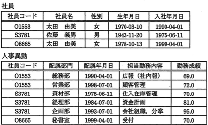
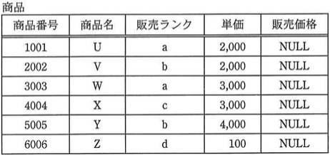
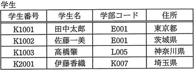
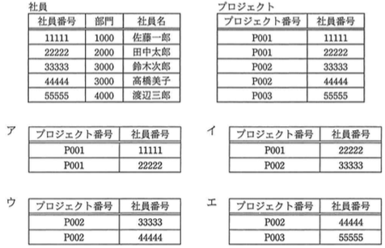

# SQL Lv6

----

**教材制作者へ**

このレベルには，基本情報技術者試験，応用情報技術者試験，データベーススペシャリスト試験の過去問を用いている。該当の問題には出典を明記し，出典元と表現が大きく異ならないよう作成すること。

- [過去問題](https://www.jitec.ipa.go.jp/1_04hanni_sukiru/_index_mondai.html)

IPA情報処理技術者試験では，特に指示の無い場合は，ア〜エ（もしくはそれに順ずる英数記号）の単数選択問題とする。

----

## Q1

（出典：応用情報技術者試験 平成23年度 特別 問30 をもとに作成）

"社員" 表と "人事異動" 表から社員ごとの勤務成績の平均を求める適切なSQL文はどれか。ここで，求める項目は，社員コード，社員名，勤務成績（平均）の3項目とする。

ア　SELECT 社員.社員コード, 社員名, AVG(勤務成績) AS "勤務成績（平均）" 
　　　FROM 社員, 人事異動 
　　　WHERE 社員.社員コード = 人事異動.社員コード 
　　　GROUP BY 勤務成績 

イ　SELECT 社員.社員コード, 社員名, AVG(勤務成績) AS "勤務成績（平均）" 
　　　FROM 社員, 人事異動 
　　　WHERE 社員.社員コード = 人事異動.社員コード 
　　　GROUP BY 社員.社員コード, 社員.社員名 　　

ウ　SELECT 社員.社員コード, 社員名, AVG(勤務成績)/COUNT(勤務成績) AS "勤務成績（平均）" 
　　　FROM 社員, 人事異動 
　　　WHERE 社員.社員コード = 人事異動.社員コード 
　　　GROUP BY 社員.社員コード, 社員.社員名 　　

エ　SELECT 社員.社員コード, 社員名, MAX(勤務成績)/COUNT(*) AS "勤務成績（平均）" 
　　　FROM 社員, 人事異動 
　　　WHERE 社員.社員コード = 人事異動.社員コード 
　　　GROUP BY 社員.社員コード, 社員.社員名 

### Hint1

設問のSQLでは，WHERE句において，社員コードを使って，"社員" 表と "人事異動" 表を内部結合している。

**結合結果（必要な部分のみ抜粋）**

|社員.社員コード|社員.社員名|...|人事異動.社員コード|...|人事異動.勤務成績|
|:-:|:-:|:-:|:-:|:-:|:-:|
|O1553|太田 由美|...|O1553|...|69.0|
|O1553|太田 由美|...|O1553|...|72.0|
|S3781|佐藤 義男|...|S3781|...|70.0|
|S3781|佐藤 義男|...|S3781|...|81.0|
|S3781|佐藤 義男|...|S3781|...|95.0|
|O8665|太田 由美|...|O8665|...|70.0|

### Hint2

求める項目は 社員コード，社員名，勤務成績（平均）であるため，社員コード・社員名ごとに集約した平均を計算できればよい。

そのため，GROUP BY 句が 社員.社員コード, 社員.社員名 であるイ・ウ・エのいずれかが適切である。

### Hint3

イ・ウ・エの中で，正しく平均を計算している関数は AVG(勤務成績) である。

したがって，答えは　イ。

答え　イ

## Q2

（出典：基本情報技術者試験 平成26年度 春期分 問28 をもとに作成）

"商品" 表, "在庫" 表に対する次のSQL文の結果と同じ結果が得られるSQLはどれか。

ア　SELECT 商品番号 FROM 在庫 
　　　WHERE EXISTS （SELECT 商品番号 FROM 商品） 

イ　SELECT 商品番号 FROM 在庫 
　　　WHERE NOT EXISTS （SELECT 商品番号 FROM 商品） 

ウ　SELECT 商品番号 FROM 商品 
　　　WHERE EXISTS （SELECT 商品番号 FROM 在庫 
　　　　WHERE 商品.商品番号 = 在庫.商品番号） 

エ　SELECT 商品番号 FROM 商品 
　　　WHERE NOT EXISTS （SELECT 商品番号 FROM 在庫 
　　　　WHERE 商品.商品番号 = 在庫.商品番号） 

### ヒント1

設問のSQLは，サブクエリにより検索された "在庫" 表内の商品番号を<u>含まない</u>ものを抽出条件に，"商品" 表を検索するものである。

つまり， "在庫" 表の商品番号と一致しないものが "商品" 表から抽出される。

### ヒント2

ア・イは，どちらも "商品" 表の商品番号を元に，"在庫" 表を検索するものなので，適さない。

### ヒント3

EXISTS句は，検索結果1行ごとにサブクエリを評価し，条件に合う場合に true となる。

"商品" 表の1行ごとに，"在庫" 表の商品番号と一致しないものを検索しているSQL文は，エである。

答え　エ

## Q3

（出典：応用情報技術者試験 平成27年度 秋期分 問29 をもとに作成）

"倉庫別商品在庫集計" 表から，在庫数の合計を求めたい。倉庫番号 'C003' の倉庫で在庫数が 100 以上の商品に対して，全ての倉庫における在庫数の合計を求めるSQL文の a に入る適切な字句はどれか。ここで，該当する商品は複数存在するとともに在庫数が 100 未満の商品も存在するものとする。また, 実数の下線は主キーを表す。

倉庫別商品在庫集計(<u>倉庫番号</u>, <u>商品コード</u>, 在庫数)

(SQL文) 
SELECT 商品コード, SUM(在庫数) AS 在庫合計 FROM 倉庫別商品在庫集計 
　　WHERE [  a  ] 
　　GROUP BY 商品コード 

ア　商品コード = (SELECT 商品コード FROM 倉庫別商品在庫集計 
　　　　WHERE 倉庫番号 = 'C003' AND 在庫数 >= 100) 

イ　商品コード = ALL (SELECT 商品コード FROM 倉庫別商品在庫集計 
　　　　WHERE 倉庫番号 = 'C003' AND 在庫数 >= 100) 

ウ　商品コード IN (SELECT 商品コード FROM 倉庫別商品在庫集計 
　　　　WHERE 倉庫番号 = 'C003' AND 在庫数 >= 100) 

エ　EXISTS (SELECT * FROM 倉庫別商品在庫集計 
　　　　WHERE 倉庫番号 = 'C003' AND 在庫数 >= 100) 

### Hint1

設問のSQLは，サブクエリ(aの部分）で，抽出する 倉庫別商品在庫集計 の行の条件を指定し，商品コードごとの在庫数の合計を求める。

設問では，サブクエリのSELECT文の検索条件は全て同じであるから，演算子（=, ALL, IN, EXISTS）の違いに着目する。

### Hint2

サブクエリの結果は複数行になることが予想される。

アは，サブクエリの結果セットが単一行の時のみ有効のため，適さない。

イは，ALL句により，サブクエリの結果セット全てと商品コードが同一なものが抽出条件になってしまい，適さない。 
（例：サブクエリの結果セットが C001, C002 だったとき，商品コードがC001かつC002である行は存在しない）

### Hint3

エは，EXISTS句によりサブクエリの結果セットが1行でも存在すれば，どの行と比較する場合も必ず true となるため，抽出条件として適さない。

ウは，サブクエリの結果セットのいずれかと同一のものが抽出条件であるため，適する。

こたえ　ウ

## Q4

（出典：応用情報技術者試験 平成24年度 春期分 問26 をもとに作成）

販売価格が決められていない "商品" 表に，次のSQL文を実行して販売価格を設定する。このとき，販売ランクがbの商品の販売価格の平均値はいくらか。

UPDATE 商品 SET 販売価格 =  
　　CASE 
　　　 WHEN 販売ランク = 'a' THEN 単価 * 0.9 
　　　 WHEN 販売ランク = 'b' THEN 単価 - 500 
　　　 WHEN 販売ランク = 'c' THEN 単価 * 0.7 
　　　 ELSE 単価 
　　END 
　　

- 1,675
- 2,100
- 2,250
- 2,500

### ヒント1

設問のSQLは，CASE句内の条件にそって，販売価格を更新していく。

### ヒント2

販売ランク a の時は，単価*0.9 を販売価格にする。

販売ランク b の時は，単価-500 を販売価格にする。

販売ランク c の時は，単価*0.7 を販売価格にする。

条件に当てはまらない場合は，単価をそのまま販売価格にする。

### ヒント3

販売価格は

|商品番号|...|販売ランク|販売価格|
|:-:|:-:|:-:|:-:|
|1001|...|a|1,800|
|2002|...|b|1,500|
|3003|...|a|2,700|
|4004|...|c|2,100|
|5005|...|b|3,500|
|6006|...|d|100|

となる。ランクbの平均は，

(1,500+3,500) / 2 = 2,500

となる。

こたえ 2,500

## Q5

（出典：応用情報技術者試験 平成27年度 春期分 問28 をもとに作成）

"学生" 表が次のSQL文で定義されているとき, 検査制約の違反となるSQL文はどれか。

CREATE TABLE 学生 (学生番号 CHAR(5) PRIMARY KEY, 
　　学生名 CHAR(16), 
　　学部コード CHAR(4), 
　　住所 CHAR(16), 
　　CHECK (学生番号 LIKE 'K%')) 

ア　DELETE FROM 学生 WHERE 学生番号 = 'K1002'

イ　INSERT INTO 学生 VALUES ('J2002', '渡辺次郎', 'M006', '東京都')

ウ　SELECT * FROM 学生 WHERE 学生番号 = 'K1001'

エ　UPDATE 学生 SET 学部コード = 'N001' WHERE 学生番号 LIKE 'K%'

### ヒント1

設問のSQLから，学生表は，

- 学生番号（5文字までの文字列，主キー）
- 学生名（16文字までの文字列）
- 学部コード（4文字までの文字列）
- 住所（16文字までの文字列）
- 表制約：学生番号は K で始まる文字列

の条件で作成されている。

### ヒント2

アは，主キーである学生番号を使い行を削除するSQL文であり，適切できる。

ウは，主キーである学生番号を使い行を検索するSQL文であり，適切である。

### ヒント3

エは，学生番号が K で始まる行の学部コードを N001 に更新するSQL文であり，適切である。

イは，表に 学生番号 J2002，学生名が 渡辺次郎，学部コードが M006， 住所が 東京都 の行を追加するSQLである。

表は，学籍番号が K で始まる文字列である表制約が設定されており，学籍番号 J2002 はこれに適さず，検査制約違反となる。

答え　イ

## Q6

（出典：応用情報技術者試験 平成26年度 春期分 問28 をもとに作成）

"東京在庫" 表と "大阪在庫" 表に対して，SQL文を実行して得られる結果はどれか。ここで，実線の下線は主キーを表す。

(SQL文) 
SELECT 商品コード, 在庫数 FROM 東京在庫 
  UNION  
SELECT 商品コード, 在庫数 FROM 大阪在庫 

### ヒント1

UNION句は，SELECTステートメントの結果セットを組合せ，1つの結果セットとして扱えるようにする。

### ヒント2

UNION句は，結果セットに重複するものがあった場合，それを省く。

### ヒント3

東京在庫の検索結果セットに，大阪在庫の検索結果セットを結合し，重複を省いているものは，ウ。

答え　ウ

## Q7

（出典：応用情報技術者試験 平成26年度 春期分 問28 をもとに作成）

"東京在庫" 表と "大阪在庫" 表に対して，SQL文を実行して得られる結果はどれか。ここで，実線の下線は主キーを表す。

(SQL文) 
SELECT 商品コード, 在庫数 FROM 東京在庫 
  UNION ALL 
SELECT 商品コード, 在庫数 FROM 大阪在庫 

### ヒント1

UNION句は，SELECTステートメントの結果セットを組合せ，1つの結果セットとして扱えるようにする。

### ヒント2

UNION ALL句は，結果セットに重複するものがあってもそのまま結合する。

### ヒント3

東京在庫の検索結果セットに，大阪在庫の検索結果セットをもれなく結合しているものは，エ。

答え　エ

## Q8

（出典：応用情報技術者試験 平成26年度 春期分 問28 をもとに作成）

"東京在庫" 表と "大阪在庫" 表に対して，SQL文を実行して得られる結果はどれか。ここで，実線の下線は主キーを表す。

(SQL文) 
SELECT 商品コード, 在庫数 FROM 東京在庫 
  UNION ALL 
SELECT 商品コード, 在庫数 FROM 大阪在庫 

### ヒント1

UNION句は，SELECTステートメントの結果セットを組合せ，1つの結果セットとして扱えるようにする。

### ヒント2

UNION ALL句は，結果セットに重複するものがあってもそのまま結合する。

### ヒント3

東京在庫の検索結果セットに，大阪在庫の検索結果セットをもれなく結合しているものは，エ。

答え　エ

## Q9

（出典：データベーススペシャリスト試験 平成23年度 特別分 午前II 問6 をもとに作成）

次のSQL文によって "会員" 表から新たに得られる表はどれか。

(SQL文) 
SELECT AVG（年齢） FROM 会員 
　　GROUP BY グループ 
　　HAVING COUNT(*) > 1 

### ヒント1

設問のSQLでは，グループごとに集約を行った際に，行数が1より大きいもののみを対象に，年齢の平均値を求める。 

### ヒント2

集約の対象となるものは，グループが B および C の行である。

### ヒント3

グループBの年齢の平均は30，グループCの年齢の平均は40である。

この2つの値をもつ結果セットは，ウ。

答え　ウ

## Q10

（出典：データベーススペシャリスト試験 平成27年度 春期分 午前II 問7 をもとに作成）

過去3年分の記録を保存している "試験結果" 表から，2014年度の平均点数が600点以上となったクラスのクラス名と平均点数の一覧を取得するSQLはどれか。ここで，実線の下線は主キーを表す。

試験結果（<u>学生番号</u>，<u>受験年月日</u>，点数，クラス名）

ア　SELECT クラス名, AVG(点数) FROM 試験結果 
　　　　GROUP BY クラス名 HAVING AVG(点数) >= 600 

イ　SELECT クラス名, AVG(点数) FROM 試験結果 
　　　　WHERE 受験年月日 BETWEEN '2014-04-01' AND '2015-03-31' 
　　　　GROUP BY クラス名 HAVING AVG(点数) >= 600 

ウ　SELECT クラス名, AVG(点数) FROM 試験結果 
　　　　WHERE 受験年月日 BETWEEN '2014-04-01' AND '2015-03-31' 
　　　　GROUP BY クラス名 HAVING 点数 >= 600 

エ　SELECT クラス名, AVG(点数) FROM 試験結果 
　　　　WHERE 点数 >= 600 
　　　　GROUP BY クラス名 
　　　　HAVING (MAX(受験年月日) 
　　　　　　BETWEEN BETWEEN '2014-04-01' AND '2015-03-31') 

### ヒント1

(1) 設問から，受験年月日が2014年度（2014年4月1日から2015年3月31日の間）のものを検索しなくてはならない。

### ヒント2

(2) HAVING句には，条件に一致する検索結果を集約するグループ化の対象列もしくは集約関数のみ指定できる。

### ヒント3

(1), (2) によって，ア・ウ・エは当てはまらない。

イは，受験年月日が2014年度のデータの中から，クラス名を平均点600点以上で集約した上で，クラス名と平均点を検索結果として得られる。

答え　イ

## Q10

（出典：データベーススペシャリスト試験 平成24年度 春期分 午前II 問11 をもとに作成）

"社員" 表と "プロジェクト" 表に対して，次のSQL文を実行した結果はどれか。

SELECT プロジェクト番号, 社員番号 FROM プロジェクト 
　　　　WHERE 社員番号 IN 
　　　　(SELECT 社員番号 FROM 社員 WHERE 部門 <= '2000') 

### ヒント1

このSQLは，サブクエリの結果をもとに，"プロジェクト" 表を検索する。

### ヒント2

サブクエリでは，"社員"表から部門が2000以下の社員番号を検索する。この結果セットは，

| 社員番号 |
| :-: |
| 1111 |
| 2222 |

となる。

### ヒント3

ヒント2の結果セットをもとに，設問のSQLは

SELECT プロジェクト番号, 社員番号 FROM プロジェクト 
　　　　WHERE 社員番号 IN (1111, 2222) 
　　　　
と解釈できる。

この構文を実行した結果セットと一致するのは，アである。

答え ア
