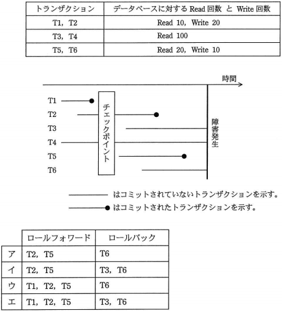

# データモデルとDBMS Lv7

----

**教材制作者へ**

このレベルには，基本情報技術者試験，応用情報技術者試験，データベーススペシャリスト試験の過去問を用いている。該当の問題には出典を明記し，出典元と表現が大きく異ならないよう作成すること。

- [過去問題](https://www.jitec.ipa.go.jp/1_04hanni_sukiru/_index_mondai.html)

特に指示の無い場合は，ア〜エ（もしくはそれに順ずる英数記号）の単数選択問題とする。

----

## Q1

（出典：基本情報技術者試験 平成28年度 春期分 問26 をもとに作成）

関係モデルとその実装である関係データベースの対応に関する記述のうち，適切なものはどれか。

ア　関係は，表に対応付けられる 
イ　属性も列も，左から右に順序付けられる 
ウ　タプルも行も，ともに重複しない 
エ　定義域は，文字型または文字列型に対応付けられる 

### ヒント1

関係モデルは，データを複数の属性の集合（リレーション）で表すことを前提としたモデルである。

### ヒント2

- 関係モデルの属性の集合は，表であらわすことができる。
- 関係モデルの属性は，表の列であらわすことができる。
- 関係モデルのタプルは，表の行であらわすことができる。
- 関係モデルの定義域は，列のデータ型が取り得る範囲であらわすことができる。

### ヒント3

- 関係モデルの属性の集合には，順序は考慮されない。
- 関係データベースの検索脚気では，タプルや行が重複することがあり得る。
- 定義域は，列の型を問わず，取り得る範囲をあらわす。

答え：ア

## Q2

（出典：応用情報技術者試験 平成27年度 秋期分 問29 をもとに作成）

ロックの両立性に関する記述のうち，適切なものはどれか。

ア　トランザクションT1が共有ロックを獲得している資源に対して，トランザクションT2は共有ロックと専有ロックのどちらも獲得することができる 
イ　トランザクションT1が共有ロックを獲得している資源に対して，トランザクションT2は共有ロックを獲得することはできるが，専有ロックを獲得することはできない。 
ウ　トランザクションT1が専有ロックを獲得している資源に対して，トランザクションT2は専有ロックと共有ロックのどちらも獲得することができる。 
エ　トランザクションT1が専有ロックを獲得している資源に対して，トランザクションT2は専有ロックを獲得することはできるが，共有ロックを獲得することはできない。 

### ヒント1

排他制御などに用いられるロックには2種類のものが存在する。

共有ロックとは，データを読み込むときに用いられるロックである。

専有ロックとは，データを更新するときに用いられるロックである。

### ヒント2

あるトランザクションから専有ロックが行われた資源には，他のトランザクションからの更新（専有ロックを伴う）処理・読み込み（共有ロック）を伴う処理が一切行えなくなる。

### ヒント3

あるトランザクションから共有ロックが行われた資源には，他のトランザクションからの更新（専有ロックを伴う）の処理を行うことはできない。ただし，他のトランザクションからの読み込み（共有ロックを伴う）処理を行うことはできる。

答え：イ

## Q3

（出典：基本情報技術者試験 平成24年度 秋期分 問30 をもとに作成）

DBMSが，データベースの更新に対して保障すべき原子性（atomicity）の単位はどれか。

ア　DBMSの起動から停止まで 
イ　チェックポイントから次のチェックポイントまで 
ウ　データベースのバックアップ取得から媒体障害の発生時点まで 
エ　トランザクションの開始からコミット又はロールバックまで 

### ヒント1

データベースの原子性とは，トランザクション処理によるACID性の一つである。

### ヒント2

原子性とは，トランザクション処理はそれ以上の細かい処理に分けることはできず，一連の処理がすべて実行されるか，すべて取り消されるかのどちらかとなることである。

### ヒント3

トランザクション処理に関する性質であるから，ひとつのトランザクションの期間を超えた性質ではない。

答え　エ

## Q4

（出典：基本情報技術者試験 平成24年度 春期分 問33 をもとに作成）

DBMSの排他制御に関する記述のうち，適切なものはどれか。

ア　アクセス頻度の高いデータの処理速度をあげるためには，排他制御が必要である。 
イ　処理速度を上げるため，排他制御を行うデータの範囲は極力大きくすべきである。 
ウ　データアクセス時のデッドロックを防止するために，排他制御が必要である。 
エ　複数の人が同時に更新する可能性のあるデータには，排他制御が必要である。 

### ヒント1

排他制御は，トランザクション処理におけるデータのロック・アンロックを用いて，あるトランザクションが他のトランザクションに影響を及ぼさないようにすることである。

### ヒント2

ロックが行われた資源に対して，他のトランザクション処理はアンロックを待ち逐次的な処理となるため，全体の処理速度は低下する。

ロックを行う範囲を広げると，他のトランザクション処理による操作が制限され，同時に処理されなくるため，データの範囲を拡大すると全体の処理速度は低下する。

### ヒント3

排他制御を用いることで，複数のトランザクションが，お互いのデータ操作に必要なデータを互い違いにロックしてしまい，双方の操作が実行できなくなるデッドロックが発生する可能性がある。

複数の利用者やアプリケーションが同時にデータを更新する可能性がある場合は，トランザクション処理による排他制御が必要である。

答え：エ

## Q5

（出典：応用情報技術者試験 平成28年度 春期分 問28 をもとに作成）

トランザクションA（処理A1→処理A2の順に実行する）とトランザクションB（処理B1→処理B2の順に実行する）が，データベースの資源SとTに対し，次のように処理A1→処理B1→処理A2→処理B2の順で専有ロックを要求する場合，デッドロックが発生する資源の組み合わせはどれか。

なお，ロックは処理開始時にかけ，トランザクション終了時に解除する。

### ヒント1

デッドロックとは，複数のトランザクションが，お互いのデータ操作に必要なデータを互い違いにロックしてしまい，双方の操作が実行できなくなってしまうこと。

### ヒント2

ロックは処理開始時にかけ，トランザクション終了時に解除される。

これにより，処理A1で使われる資源を処理B2が使うためには，処理A1を含むトランザクションAがすべて終了しなければならない。

あわせて，処理B1で使われる資源を処理A2が使うためには，処理B1を含むトランザクションBがすべて終了しなければならない。

### ヒント3

このことから，資源がトランザクションA, B両方で用いられ，かつ利用する順序がトランザクションA, Bで入れ違いになっている「イ」が，デッドロックを発生させるものとなる。

答え：イ

## Q6

（出典：応用情報技術者試験 平成27年度 秋期分 問30 をもとに作成）

チェックポイントを取得するDBMSにおいて，図のような時間経過でシステム障害が発生した。前進復帰（
ロールフォワード）によって障害回復できるトランザクションだけをすべて挙げたものはどれか。

ア　T1 
イ　T2とT3 
ウ　T4とT5 
エ　T5 

### ヒント1

DBMSでは，トランザクションがコミットされることによりログファイルにデータベースへの操作結果が保存され，ログファイルの内容がデータベースのデータファイルに反映されることでチェックポイントが作成される。

### ヒント2

チェックポイントでデータファイルに記録されたデータベースの操作結果は，障害が発生しても保持される。

### ヒント3

また，障害発生時にチェックポイントを迎えていない操作結果であっても，コミット時のログファイルを用いてトランザクションを再現し，データを復元できる。この復元機能のことを前進復帰（ロールフォワード）という。

一方で，障害発生時にコミットされていないトランザクションの操作結果はすべて破棄される。このことを後退復帰（ロールバック）という。

答え：ウ

## Q7

（出典：応用情報技術者試験 平成24年度 春期分 問31 をもとに作成）

DBMSの媒体障害時の回復法はどれか。

ア　障害発生時，異常終了したトランザクションをロールバックする 
イ　障害発生時点でコミットしていたが，データベースの実更新がされていないトランザクションをロールフォーワードする。 
ウ　障害発生時点で，まだコミットもアボートもしていなかった全てのトランザクションをロールバックする。 
エ　バックアップコピーでデータベースを復元し，バックアップ取得以降にコミットした全てのトランザクションをロールフォワードする。 

### ヒント1

DBMSの障害には大きくわけて3種類がある。

- トランザクション障害：トランザクションの不正な中断や失敗
- システム障害：システム間の通信エラーやシステム稼働の停止
- 媒体障害：物理的なデータ記憶媒体の故障，損失

### ヒント2

DBMSの障害ごとに復旧手順が定められている。

トランザクション障害からの復旧では，ログファイルの更新前情報を元に，トランザクション実行前の状態に戻す。（ロールバック）

システム障害では，ログファイルの更新後情報をもとに，チェックポイント後にコミットされた操作内容を反映する。またコミットされていない操作内容をはきするためのロールバックが行われる。

### ヒント3

媒体障害では，データベースの記録媒体そのものが破損している可能性があることから，まずはバックアップデータを元にデータベース全体を復元する。その後，ログファイルを元に，バックアップ取得以降の操作内容を全てロールフォワードする。

答え：エ

## Q8

（出典：データベーススペシャリスト試験 平成27年度 春期分 午前II 問1 をもとに作成）

データベースの3層スキーマアーキテクチャに関する記述として，適切なものはどれか。

ア　概念スキーマは，内部スキーマと外部スキーマの間に位置し，エンティティやデータ項目相互の関係に関する情報をもつ。 
イ　外部スキーマは，概念スキーマをコンピュータ上に具体的に実現させるための記述であり，データベースに対して，ただ一つ存在する。 
ウ　サブスキーマは，複数のデータベースを結合した内部スキーマの一部を表す。 
エ　内部スキーマは，個々のプログラム又はユーザの立場から見たデータベースの記述である。 

### ヒント1

3層スキーマ構造（ANSI/SPARCモデル）では，概念・内部・外部スキーマの3つにデータ定義を分ける。

### ヒント2

概念スキーマは，データベースのデータモデルにあわせた論理的なデータ構造を定義したもの。

外部スキーマは，概念スキーマで定義されたデータモデルに基づいて，ユーザやアプリケーションがデータを利用するためのデータの見え方を定義したもの。

内部スキーマは，概念スキーマで定義されたデータモデルに基づいて，実際にデータを記録するための格納方法や設定を定義したもの。

### ヒント3

サブスキーマは，外部スキーマの別称である。

答え：ア

## Q9

（出典：データベーススペシャリスト試験 平成21年度 春期分 午前II 問13 をもとに作成）

DBMSの排他制御機能に関する記述のうち，適切なものはどれか。

ア　排他制御機能によって，同時実行処理でのデータの整合性を保つことができる。 
イ　排他制御機能の使用によって，デッドロックを防止できる。 
ウ　排他制御はDBMSが自動的に行い，アプリケーションプログラムからロック，アンロックの指示はできない。 
エ　バッチによる更新処理では排他制御を行う必要がない。 

### ヒント1

排他制御は，トランザクション処理におけるデータのロック・アンロックを用いて，あるトランザクションが他のトランザクションに影響を及ぼさないようにすることである。

### ヒント2

排他制御を利用することで，複数のトランザクションが，お互いのデータ操作に必要なデータを互い違いにロックしてしまい，双方の操作が実行できなくなるデッドロックが発生する可能性がある。

排他制御では，アプリケーションプログラムや利用者が明示的に資源へのロック・アンロックを指示できる。

### ヒント3

バッチによる更新処理であっても，複数のトランザクションが同時に実行される場合は排他制御が必要である。

排他制御を用いることで，トランザクションが同時に実行される環境でも，データの整合性を保つことができる。

答え：ア

## Q10

（出典：データベーススペシャリスト試験 平成27年度 春期分 午前II 問14 をもとに作成）

DBMSをシステム障害発生後に再立ち上げするとき，ロールフォワードすべきトランザクションとロールバックすべきトランザクションの組み合わせとして，適切なものはどれか。ここで，トランザクションの中で実行される処理内容は次のとおりとする。

### ヒント1

DBMSでは，トランザクションがコミットされることによりログファイルにデータベースへの操作結果が保存され，ログファイルの内容がデータベースのデータファイルに反映されることでチェックポイントが作成される。

### ヒント2

チェックポイント後〜障害発生前の間にコミットされているものはロールフォワード，コミットされていないものはロールバックの対象である。

ここでは，T2とT5がロールフォワードすべき対象である。

### ヒント3

ロールフォワードすべき対象は，T3とT4とT6である。

しかしながら，データベースへの操作が読み込みのみのトランザクションは，データベースのデータの変更を伴わないため，ロールフォワードは不要となる。

これにより，ロールフォワードすべき対象はT6に絞られる。

答え：ア
